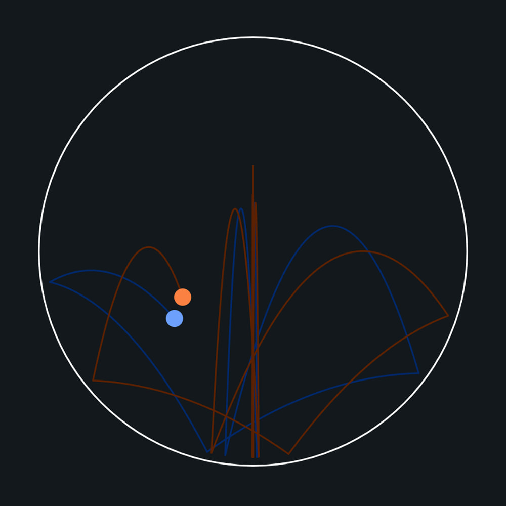
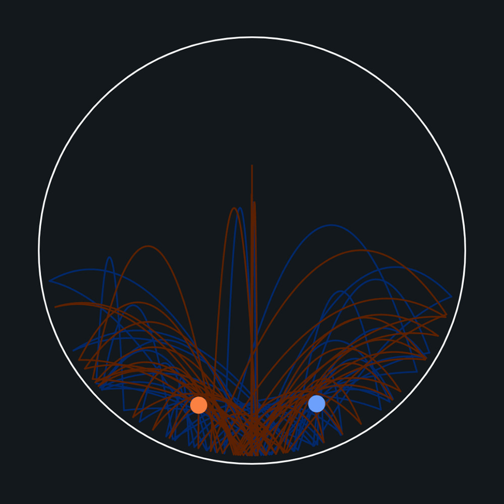

<h1 align="center">Bouncing Balls</h1>

Inspired by <a href="https://www.youtube.com/watch?v=6z4qRhpBIyA">this Numberphile video</a>, this is a simple system that demonstrates chaos theory.

Two balls start at almost exactly the same point, but their trajectories rapidly diverge after only a few bounces.


## Live Preview
<a href="" target="_blank">click here for live preview</a>

## Screenshots

<p align="center">


</p>


## In case you want to try it
### Install dependencies
```
$ pnpm install
```
### Run
```
$ pnpm serve
```

### Development
```
$ pnpm dev
```

## Implementation 
I used some kind of <a href="https://en.wikipedia.org/wiki/Verlet_integration">Verlet integration</a> to calculate the physics of the ball. Not very accurate, but enough for this a simple visualization.
